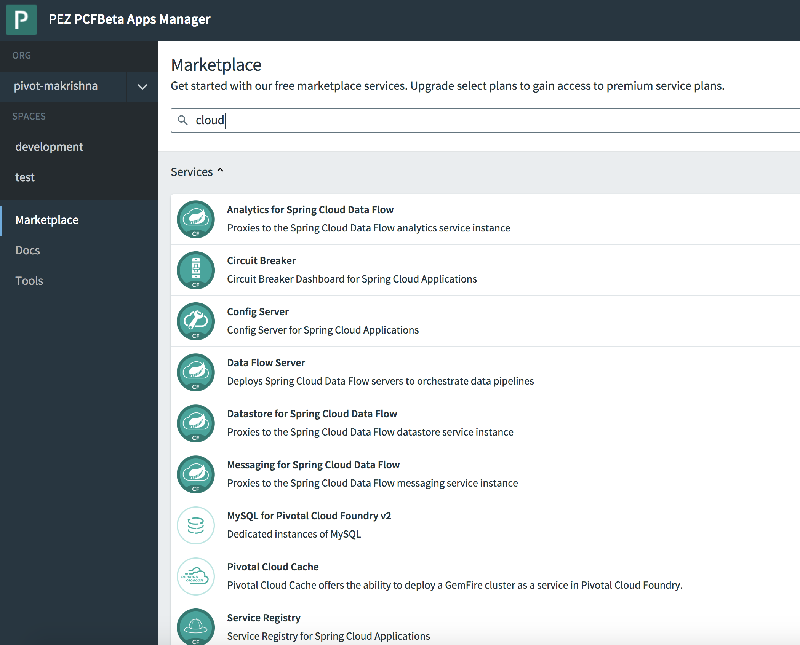

= Lab 2 - Cloudfoundry Services with Pivotal Cloud Cache and MySQL

[abstract]
--
This workshop will provide developers with hands on experience in building Pivotal Cloud Cache(PCC) clients using Spring Data GemFire (SDG), Spring Data REST, Spring Cloud and Spring Boot. In this session we'll be implementing a pizza store app for ordering pizza backed by PCC. Session includes presentations, demos and hands on labs.

Cloud Foundry services are managed through two primary types of operations:

Create/Delete:: These operations create or delete instances of a service.
For a database this could mean creating/deleting a schema in an existing multitenant cluster or creating/deleting a dedicated database cluster.
Bind/Unbind:: These operations create or delete unique credential sets for an existing service instance that can then be injected into the environment of an application instance.
--

== SECTION 1: The Services Marketplace

There are two ways to discover what services are available on Pivotal Cloudfoundry.
The first is available on any instance of Cloud Foundry: the CLI. Just type:

----
$ cf marketplace
----

and you'll get a list of services, their available plans, and descriptions. On Pivotal Cloudfoundry, the ``free'' tier of plans is normally the first one listed.

The second way is specific to Pivotal Cloudfoundry's Apps Manager UI.
If you haven't already, login to it by visiting http://console.devcloudwest.inbcu.com

Click on the ''Marketplace'' link, and you'll see the same service/plan/description listing in the browser:

== SECTION 2: Setup MySQL and Pivotal Cloud Cache Services

=== Create Mysql Service Instance

Pizza store app will make service calls to this mysql instance

----
cf create-service p.mysql db-small workshop-db
----

=== Create PCC Instance
Services can be created through Apps Manager Marketplace or by executing cf cli commands

==== Display available PCC plans

----
cf marketplace -s p-cloudcache
----

===== Step 1: create a PCC OnDemand service in your org & space

----
cf create-service p-cloudcache extra-small workshop-pcc

----

===== Step 2: Create service key for retrieving connection information for GFSH cli

----
cf create-service-key workshop-pcc devkey
----

===== Step 3: Retrieve url for PCC cli (GFSH) and corresponding credentials 

----
cf service-key workshop-pcc devkey
----

This will return info about the cluster login.

----
 "urls": {
  "gfsh": "https://cloudcache-ca3ab6cf-53ea-4495-8f8f-57a201c32257.cf.*******.net/gemfire/v1",
  "pulse": "https://cloudcache-ca3ab6cf-53ea-4495-8f8f-57a201c32257.cf.*******.net/pulse"
 },
 "users": [
  {
   "password": "*********",
   "roles": [
    "cluster_operator"
   ],
   "username": "cluster_operator_*********"
  }
----

===== Step 4: Login into to PCC cli (GFSH)

Replace URL and password with the info retrieved above

----
connect --use-http=true --url=http://gemfire-xxxx-xxx-xx-xxxx.system.excelsiorcloud.com/gemfire/v1 --user=cluster_operator --password=*******
----

===== Step 5: create PCC regions

Note: Region name created on PCC server and client should match

----
create region --name=customer --type=PARTITION_REDUNDANT_PERSISTENT
create region --name=pizza_orders --type=PARTITION_REDUNDANT_PERSISTENT
----

== SECTION 3: Deploy the Pizza Store App and bind MySql and PCC Services

=== Deploy the Pizza Store App

. Change to the _pizza-store-pcc-client_ application directory:
+
----
$ cd ../../pizza-store-pcc-client
----
+
Open the manifest.yml file. You will see the following:
+
----
applications:
- name: pizza-store-pcc-client
  random-route: true
  path: target/pizza-store-pcc-client-0.0.1-SNAPSHOT.jar
----
+
This will app will be deployed with the name pizza-store-pcc-client using target/pizza-store-pcc-client-0.0.1-SNAPSHOT.jar and a random route url.

Let's deploy without starting the app.

----
cf push --no-start
----

=== Bind the services to the Pizza Store App

----
cf bind-service pizza-store-pcc-client workshop-db
cf bind-service pizza-store-pcc-client workshop-pcc
----

=== Start the Pizza Store App

----
cf start pizza-store-pcc-client
----

== SECTION 4: Run the Pizza Store App

=== Setup the database

Let's load the db using /load endpoint. Make sure to use your route URL

https://pizza-store-pcc-client-boring-crane.cfapps.haas-69.pez.pivotal.io/loaddb?amount=100

----
New customers successfully saved into Database
----

Let's fetch top 10 customers using /showdb endpoint. Make sure to use your route URL

https://pizza-store-pcc-client-boring-crane.cfapps.haas-69.pez.pivotal.io/showdb

----
First 10 customers are show here: 
Customer [id=0FsIMYG30, name=Brody England, email=england@gmail.com, address=59644 New York, birthday=1973-07-16T03:34:20.016Z]
Customer [id=2afB7G57Z, name=Ella Robbins, email=ella.robbins@mail.com, address=72508 San Francisco, birthday=1942-05-23T20:49:41.209Z]
Customer [id=2dO6dSUIs, name=Eva Fischer, email=fischer@mail.com, address=66604 New York, birthday=1949-05-29T22:01:01.136Z]
Customer [id=2mDAi0qRr, name=Gianna Merritt, email=merritt@yahoo.com, address=25734 Washington, birthday=1969-01-20T14:08:36.941Z]
....
----

=== Pizza Store APIs

Lets look at the APIs available for our pizza store app using /pizzas endpoint.

https://pizza-store-pcc-client-boring-crane.cfapps.haas-69.pez.pivotal.io/pizzas

----
Lets Order Some Pizza 
-------------------------------
types: plain, fancy

GET /orderPizza?email={emailId}&type={pizzaType} - Order a pizza 
GET /orders?email={emailId} - get specific value 

----

Now we can order some pizza by invoking /orderPizza endpoint. Make sure to use your route URL and pick an email address from data returned by /showdb endpoint.

https://pizza-store-pcc-client-boring-crane.cfapps.haas-69.pez.pivotal.io/orderPizza?email=fischer@mail.com&type=fancy

==== Result

Cache Miss Scenario

When you call that endpoint for the first time. Cache is missed and data is pulled from DB.

----
Result [Pizza{name='fancy', toppings=[arugula, chicken], sauce='pesto', Customer='Customer [id=05eKpgOFA, name=Lucy Norton, email=lucynorton@gmail.com, address=48665 Washington, birthday=1965-02-10T06:20:27.828Z]'}] 
Cache Miss for Customer [true] 
Read from [MYSQL] 
Elapsed Time [234 ms]
----

Data Returned From Cache 

Invoke that endpoint again, and this time data will be pulled from Cache and it will return much faster.

https://pizza-store-pcc-client-boring-crane.cfapps.haas-69.pez.pivotal.io/orderPizza?email=fischer@mail.com&type=fancy

----
Result [Pizza{name='fancy', toppings=[arugula, chicken], sauce='pesto', Customer='Customer [id=05eKpgOFA, name=Lucy Norton, email=lucynorton@gmail.com, address=48665 Washington, birthday=1965-02-10T06:20:27.828Z]'}] 
Cache Miss for Customer [false] 
Read from [PCC] 
Elapsed Time [2 ms]
----

==== Order Status

We can look at the order status using /orders endpoint.

But first, lets create an index in our cache, by going to gfsh cli.

----
create index --name=CustomerEmailIndex --region="/pizza_orders o" --expression="o.customerInfo.email"
----

If you look at the code under io.pivotal.data.repo.PizzaOrderRepo, we are using the index with our query.

Now lets fetch the order status

https://pizza-store-pcc-client-boring-crane.cfapps.haas-69.pez.pivotal.io/orders?email=nathan.mendez@mail.com

It will use the index and fetch data from Cache

----
Result [Pizza{name='plain', toppings=[cheese], sauce='red', Customer='Customer [id=2gOSU3V2O, name=Nathan Mendez, email=nathan.mendez@mail.com, address=91105 New York, birthday=1955-07-16T01:13:31.733Z]'}
] 
Elapsed Time [24 ms]
----